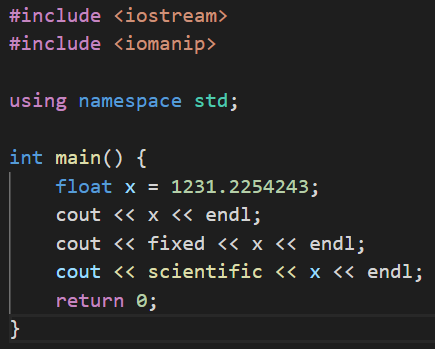
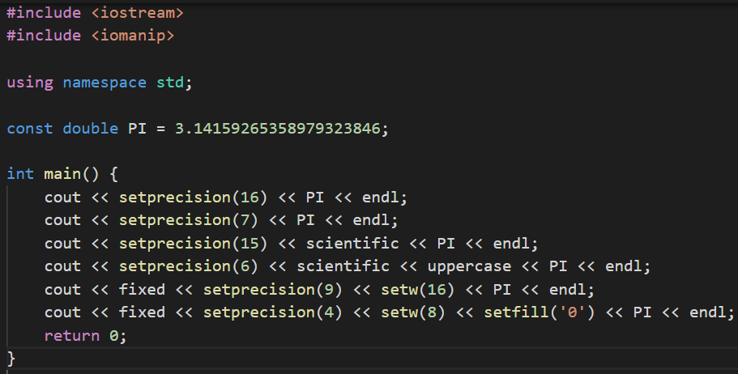
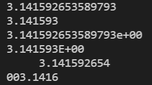
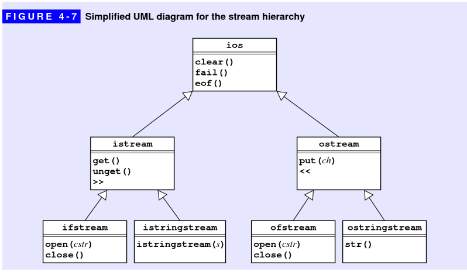
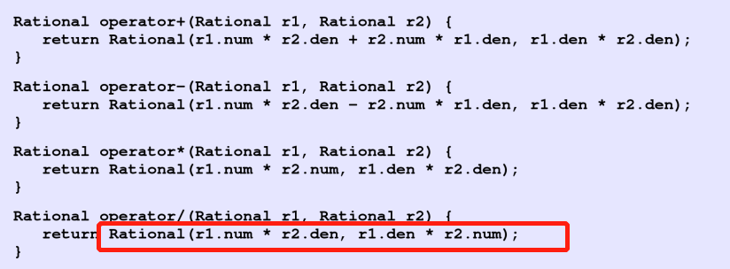
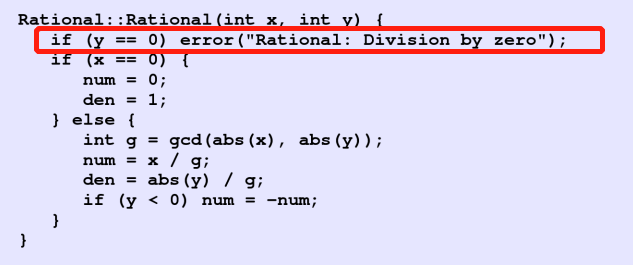

# CSC3002-Review-Question-Unofficial-Answer


## Ch1: Overview of C++

1. Source file.
2. `//` and `/*  */`. 
3. `< >` for C++ Standard library like `<iostream>`, ` <vector>`; `" "` for External library defined by users like `“morsecode.h”`.
4. `const double CENTIMETERS_PER_INCH = 2.54;`
5. `main`; `return 0;`. 
6. Line break, end current line and output a new line.
7. `int i = 0;` means `int(type) i(name) = 0(value); `. Scope is $-2^{31} \sim 2^{31}-1$. 
8. a, b, c, f, h, k, l


9. domain of values & operations
10. domain of values & operations
11. ASCII = *America Standard Code for Information Interchange*
12. true(1), false(0)
13. `double x;`,  `cin >> x;`
14. `cout << “i=” << i << “ d = ” << d << “ c = ” << c << “ s = “ << s;`
15. 5 (`int`), 3 (`int`), 3.8 (`double`), 18.0 (`double`), 4 (`int`), 2 (`int`)
16. **Unary minus**: represent negative number, can work as the left value; **Subtraction**: minus two numbers, an operation, requires two numbers to operate.   
17. When a number exceeds the scope of its type, the number’s bit will be cut down for assignment.


18. Transform a type to another type. `int i; double j = 9.9; i = int(j);`

19. (a) 4; (b) 2; (c) 42; (d) 42.

20. `a = (x>y) ? x: y;`

21. `++x`: add x by 1 and return; `x++`: return x first and then add x by 1;

22. Only calculate right-side value when necessary. E.g., `if (1 == 1 || x = y)`: this will not judge whether x equals to y since left term is always `true`.

23. ```cpp
    if (/*condition*/){ /*expression1*/ } else{ /*expression2*/ };
    switch(/*variable*/){
        case 1:{ /*expression1*/ break;} 
        case 2:{ /*expression2*/ break;}
        default:{ /*expressionx*/ break;}
    }
    while(/*condition*/){
        /*expression*/
    }
    for (/*init*/;/*stop*/;/*step*/){ /*expression*/ }
    ```

24. Select a case to execute. `break` means exit current switch statement, or the program will execute the consecutive next case.

25. The value to stop iteration.

26. ```cpp
    for (int i=1;i<=100;i++) {  }
    for (int i=0;i<100;i+=7) {  }   
    for (int i=100;i>=0; i-=2) {  }
    ```

    

## Ch2 Functions and Libraries

1. **Function:** receive an input, give an output, part of the program. **Program:** a complete executing unit.
2. **Call:** Invoke the function. **Argument:** variables passed to the function. **Return:** function output value

3. **False.** No need to write a prototype every time, main() also doesn’t need.
4. `double sqrt(double i);`
5. Yes. For example, in `if` condition statement.
6. Function that returns a `bool` value.
7. *Overloading*: Define multiple implementation for the same function name (but different function parameters) Use signatures to choose the most appropriate implementation to invoke.


8. Write the variable’s initial value in the prototype / function name. E.g., `int f(x, y = 0);`
9. False. `int f(x = 0, y)` is false, it will cause ambiguity when invoking `f(1)`;
10. The memory to store local variables (initialize in function).
11. The value of each argument is copied into the corresponding parameter variable when calling a function. 
12. Local is its scope, the variable’s life cycle is inside the function. When the function finished, the variable will be destructed. 
13. It means *call by reference* [doge], No new variables are created. 
14. Use &. E.g., `func(ostream & os)`

15. Explanation from slides: 

    


16. `#include “mylib.h”`
17. Use `extern`
18. Unified, Simple, Sufficient, Flexible, Stable
19. Maintain the same structure and effect. Making changes in the behavior of a library forces clients to change their programs, this reduces its utility.
20. Pseudo random, which means it’s not actually pure random, but having some certain rules.
21. Largest `int` type number, $2^{31} - 1$. 

22. Explanation from textbook: 


23. `randomInteger(1, 100)`
24. It depends on the implementation actually. For Stanford Library’s case, the answer is Yes, be like $\{-5, -4, -3, …, 3,4\}$. The source code: 


25. No, `d1` and `d2` will have the same value.
26. true (if not set the seed according to current time)
27. Initial state of the random number, to generate random sequence.
28. Set the seed fixed.
29. Please see [Stanford Library random.h docs](https://web.stanford.edu/dept/cs_edu/resources/cslib_docs/random.html)


## Ch3 Strings

1. String is the combination of characters (superset).
2. False (If there is a space, it will only read the part before the space)
3. Both `istream` and `string`.


4. Method: string.size(). Use a dot after the variable. Function: getline(cin, string); Use a parentheses 

5. False. It should be str.length() (method instead of function)

6. s1. Method meaning: replace(pos, len, str) Start from index pos, replace string with length len with sting s2. Please view [docs](http://www.cplusplus.com/reference/string/string/replace/)

7. Connect two strings.

8. Start from head, compare the ASCII value of each character at the same position until difference. E.g. `“abc” < “abd”` (ASCLL value of ‘d’ is larger than ‘c’)

9. `str[i]`, `str.at(i)`. The latter one will check whether the index is out of boundary.

10. `[]` will not check effectiveness. `.at()` will throw out an exception of “out of range”

11. True

12. True

13. `str.substr(pos, len)`. Start from index `pos`, return a cut string with length `len`. Omit the second parameter: Cut the string until the end. E.g. `“abcde”.substr(2)` is `“cde”`

14. `string::npos`. Please view [docs](http://www.cplusplus.com/reference/string/string/find/)  **(?)**

15. repeat with problem (13)

16. It means the finding starts from index `pos`.

17. `5`; `0`; `‘C’`; `“ABCDE”`; `“a”`; `“ZCDE”`; `“ABC”`; `“E”`; `“DE”`; `“DE”`.

18. ```cpp
    for (int i=0; i<str.length(); i++){/*do things with str[i]*/} 
    for (char ch:string) {/*do things with ch*/}
    ```

19. ```cpp
    for (int i=str.length()-1;i>=0;i--) {/*do things with str[i]*/}
    ```

20. Use `+` operator

21. `False`; `True`; `False`; `7`; `‘A’`; `‘a’`.

22. For the compatibility with C language.

23. ```cpp
    // string to char[]:
    string str = "abc";
    str.c_str();
    // char[] to string:
    char* cstr = "abc";
    str = string(cstr)
    ```


## Ch4 Streams

1. `fstream`, `ifstream`, `ofstream`

2. `<<`: insertion operator  `>>`: extraction operator

3. `<<` returns output stream (`cout`).  `>>` returns input stream (`cin`). To support chain operations.

4. Operator to change format (`skipws`, `noskipws`, `ws`)

5. Transient: take effect once; Persistent: take effect forever

6. Fixed: fixed-point notation.

   Scientific: scientific notation. 

   Default: Round the float number and output.




7. Please view the code and [materials](http://c.biancheng.net/view/275.html): 





8. For file I/O operations: read file, write file. 

9. When using open, one should convert the string to C-style string first. `fstreamName.open(filename.c_str());`

10. Use `fstreamName.fail()`

11. `fstreamName.get() == EOF` or `fstreamName.get() == fstreamName.eof()`

12. There may be other characters like Chinese or Korean outside ASCII range (0~255).

13. Read the character back to the stream. [additional materials](https://blog.csdn.net/RuizeMa/article/details/6149662)

14. ```cpp
    string stringVar;
    while (getline(cin, stringVar)) {/*do things with stringVar*/}
    ```

    Just judge whether the return value of getline() is false;

15. `stringstream` deals with string (commonly used scenario: type conversion). `fstream` deals with file read/write.
16. subclass: subclass; superclass: superclass; inheritance: inheritance. 

> 听君一席话，有如听君一席话 (Please check slides)

17. The hierarchy diagram; False, it's a superclass. 



18. For more general purpose. E.g. deal with `cin` / `cout`, `stringstream`.
19. Can handle error checking. E.g. whether there is a space.
20. Google / Baidu.


## Ch5 Collections

1. True. (If you have come to my tutorial, you gonna remember this question, type like `int` / `char` / `double` are defined in representation) 
2. Simplicity, Flexibility, Security
3. Standard template library
4. `#include “vector.h”`
5. Dynamic size; Support insert/delete operations; More flexible initialization
6. Check whether the index is out of boundary
7. Classes that include a base-type specification (`vector<int>`)


8. `vector<bool>`
9. False. The default size is 0 but not 10
10. `Vector<int> vec(20,0);`
11. The member function: `.size()`
12. 0 to N-1 (The first argument to `insertAt()` is an index number, and the new element is inserted before that position). 0 to N-1 (Remove the element at the index)
13. The operator `[]`
14. To avoid copying a new vector/object and consume great storage and time
15. `Grid<char> chessboard(8,8)`, `vector<vector<char>> chessboard(8, vector<char>(8))`. 
16. `chessboard[7][0] = ‘R’;`, `chessboard[7][7] = ‘R’;`.
17. Last In First Out: Stack; First In First Out: Queue; 
18. `push()` & `pop()`
19. `enqueue()` & `dequeue()`
20. Return the element at the top (the first one)
21. We can only simulate discrete time instead of continuous time (0, 1, 2, … minutes)
22. Key & Value.
23. (For example, default value of `int` is 0)


24. The operator `[]`

25. Lexicon class is space-efficient and convenient to iterate

26. `.txt` and `.dat` files

27. ```cpp
    // C++
    for (type var : collection) {}; 
    // Stanford Lib
    foreach (type var in collection);
    ```

28. Destroy the implicit data structure. Destroy their definition and access rules of *FIFO* and *LILO*, can only access element from one side. 

29. (Stanford Lib) `Vector`: index order. `Map` & `Set`: no specific order, sometimes alphabetic order


## Ch6 Class

1. Find them in PPT
2. public: Accessible and modifiable by instance object. private: Not accessible by external instance but in the internal class definition. The difference is whether it is available to the clients or not.
3. False. Although this is the fundamental difference, but there are other differences like no inheritance for struct and the struct’s space is on stack and class on heap.
4. The dot operator `.`
5. `Class name()` (e.g. BigInt() )
6. 1, which is the class object itself: *this (just like **self** in python), hidden **(?)**
7. The function to access or set instance variables.
8. Impossible to modify the values of any instance (member) variables.
9. Use the double colon :: (e.g BigInt::) as the namespace
10. Separated files for private part and use `#include` to include them. 
11. `int operator% (int x, int y)`
12. prefix (`++date`): first add/minus then return. Suffix (`date++`): first return then add/minus. add an `int` in the parameter list.

```cpp
Date operator++(Date & date);  // prefix
Date operator++(Date & date, int);  // suffix
```

13. Stream type variable cannot copy by value. (If we do not return by reference, it’s return by value, the stream will be copied to another variable and return, but it’s forbidden)
14. False. It depends.
15. *Method based:* overload operators as a member function, has a default hidden argument: *this, it can access private member variables freely. *Free-function-based:* Easy to read and understand. But no access to private variables unless using “friend” symbol.

```cpp
// method based (in class definition)
Date Date::operator+(int delta) { }
// free function based (outside class definition)
Date operator+(Date date, int delta) { }
```

16. The method or another class can access the private variables of this class.
17. To iterate all directions. To define clockwise/counter-clockwise iteration.
18. Check PPT. (Think – decide private variables – design constructor – design operations/free functions – code, test)
19. A number that can be written as a fraction (a / b).
20. `num` and `den` are relatively prime, `den > 0`
21. No check on divide operator, but on constructor. 





22. `<<` does not need to access private variable, it invokes public function `.toString()`
23. A Logical unit in a string
24. Iterate input, use `scanner.nextToken()` to get next token
25. `TokenScanner scanner();`, `scanner.ignoreWhitespace();`
26. Design method, set public variable/function, private variable/function reasonably.


## Ch7 Recursion

